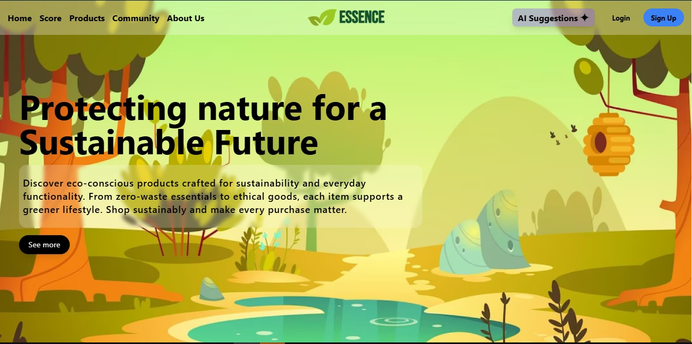
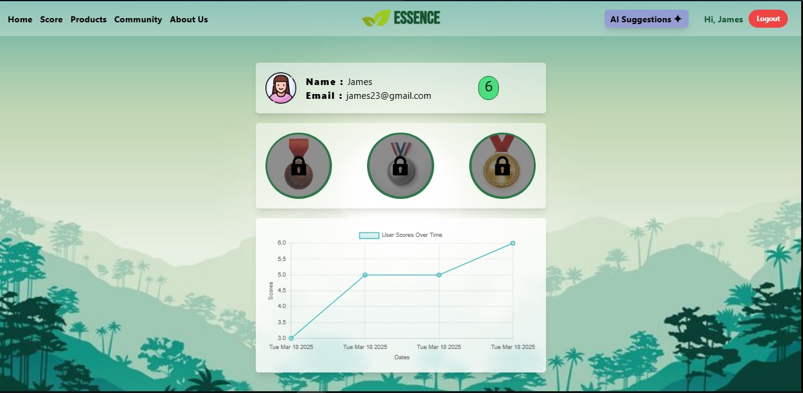
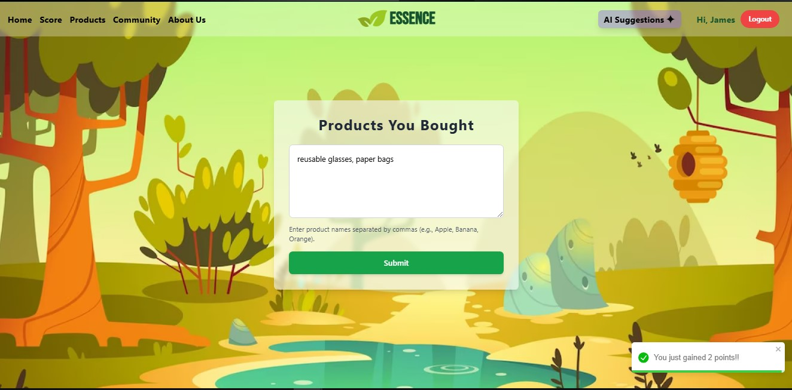
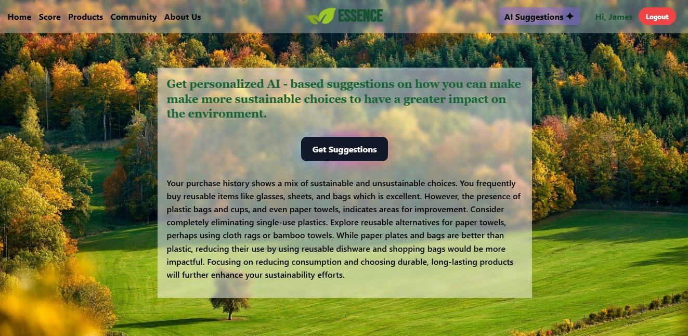
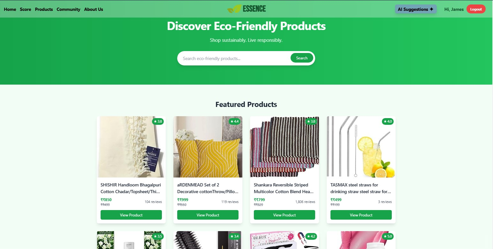

# ESSENCE : Sustainable Shopping & Consumption Assistant

## Overview

**Essence** is an innovative platform designed to help consumers make environmentally conscious purchasing decisions. By providing transparency into the sustainability of everyday products, suggesting eco-friendly alternatives, and tracking personal progress toward sustainable consumption, this project empowers users to shop responsibly and reduce their environmental impact.

The platform integrates features like a barcode scanner, browser extension for online shopping, AI-based product recommendations, and much more—aiming to guide users in adopting sustainable shopping habits with ease and convenience.

## Problem Statement

Consumers are often unaware of the environmental impact of the products they purchase due to the lack of accessible and transparent sustainability information. This project addresses this issue by providing tools that allow users to assess the sustainability of products, track their consumption habits, discover eco-friendly alternatives, and make informed purchasing decisions.

## Key Features

### 1. **Eco-Score Product Scanner**

- **Scan Barcodes**: Simply scan the barcode of any product or manually search for the product name to receive an **eco-score**. This score evaluates the sustainability of a product based on factors like:
  - **Packaging** (Is it recyclable or compostable?)
  - **Carbon Footprint** (How much CO2 was emitted during production?)
  - **Ethical Sourcing** (Are the ingredients/materials sourced responsibly?)

### 2. **Browser Extension for Online Shopping**

- **Sustainability Scores in Real-Time**: This browser extension assigns sustainability scores to products in online shopping carts, particularly focusing on Amazon products.
- **Alternative Suggestions**: If a product has a low sustainability score, the extension automatically suggests more eco-friendly alternatives, guiding users toward greener options.

### 3. **Sustainable Shopping Tracker**

- **Track Purchases**: Users can log their purchases and track their environmental impact over time. This tracker allows users to see how their shopping choices are affecting the planet and encourages mindful consumption.
- **Set Sustainability Goals**: Users can set personal sustainability goals, such as reducing plastic waste or lowering carbon footprints, and track their progress.

### 4. **Alternative Product Recommendations**

- **AI-driven Suggestions**: Based on a user’s purchase history and preferences, the platform recommends eco-friendly alternatives. These suggestions highlight products with:
  - **Recyclable Packaging**
  - **Ethical Brands**
  - **Lower Carbon Footprint**

### 5. **Local Sustainable Retail Finder**

- **Find Nearby Eco-friendly Stores**: The platform helps users locate nearby zero-waste stores, refill stations, and ethical marketplaces that align with sustainable shopping principles.

### 6. **Gamification & Rewards**

- **Earn Rewards**: Users can earn badges and rewards for their sustainable shopping habits, such as:
  - **Choosing Plastic-Free Products**
  - **Supporting Ethical Brands**
- This feature aims to make sustainability more engaging and motivate users to adopt greener habits.

### 7. **Community & Awareness Hub**

- **Share Tips and Discover Brands**: A space where users can exchange sustainability tips, discover responsible brands, and participate in eco-friendly challenges and discussions.
- **Stay Informed**: The hub offers news, blog posts, and articles to keep users informed about the latest sustainability trends.

## How It Works

- **Eco-Score Product Scanner**: By scanning barcodes or searching for products, users instantly receive an eco-score for each item. The score is based on various sustainability factors, helping users identify more sustainable alternatives.
- **Browser Extension**: The extension works seamlessly with online shopping carts, providing users with real-time sustainability scores for the items they’re about to purchase. When a less eco-friendly option is detected, the extension suggests greener alternatives.

- **AI-based Recommendations**: Our platform uses AI to recommend products based on users' purchase history, offering suggestions that align with sustainability values like recyclability, ethical sourcing, and lower carbon footprints.

- **Shopping Tracker**: Users can track their purchases over time, visualize the total environmental impact, and set goals to reduce waste or carbon emissions. This feature helps users stay motivated and aware of their shopping habits.

## Screenshots

Here are some screenshots showcasing the key features of the platform:

## Future Enhancements

- **Integration with Other Platforms**: We plan to expand the browser extension to work with additional e-commerce platforms beyond Amazon, providing sustainability scores for a wider range of online stores.
- **More Comprehensive AI Suggestions**: We aim to refine the AI recommendation engine to offer even more personalized and tailored suggestions based on user preferences and evolving sustainability trends.
- **Expanded Local Retail Finder**: We’ll work on incorporating a larger database of local zero-waste and ethical stores, making it easier for users to find sustainable shopping options near them.

## Conclusion

**Essence** is a comprehensive platform that empowers consumers to make smarter, more sustainable shopping decisions. By combining real-time product sustainability assessments, eco-friendly suggestions, and progress tracking, the platform helps users reduce their environmental impact and embrace responsible consumption habits. With features like the Eco-Score Product Scanner, AI-driven recommendations, and a gamified experience, we hope to create a world where shopping responsibly is not just easy, but rewarding.
